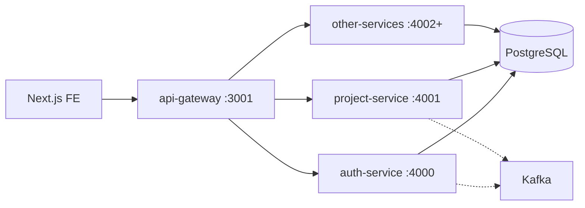

# Architecture

## Principles

1. **One database, many services** — Single Postgres `n0_platform`, schema `public`. Each service owns its tables; use TypeORM migrations per service (`synchronize: false`).
2. **Gateway-first** — The Next.js FE talks only to **api-gateway** (`:3001`). The gateway validates JWT, rate-limits, and proxies to internal services over a private network.
3. **Service boundaries** — Microservices are not exposed on the public internet in production.
4. **Optional events** — Kafka for async integration (`ENABLE_KAFKA=false` in local dev is fine).
5. **Contract-first** — Implement endpoints from artifacts (`ALL_PROJECTS_ARTIFACT.md`, `BE_AUTH_SPEC.md`, etc.); use `n0-backend-builder` skill in Cursor.

## Request flow



## Standard service internals

```
services/<name>/
├── src/
│   ├── main.ts
│   ├── app.module.ts
│   ├── auth/              # JwtModule + global JwtAuthGuard
│   ├── common/            # api-response, api-error, errors/
│   ├── database/          # TypeORM root + migrations/
│   ├── entities/
│   ├── modules/<feature>/
│   ├── filters/           # HttpExceptionFilter → FE error envelope
│   ├── interceptors/      # ApiResponseInterceptor → FE success envelope
│   ├── middleware/        # request-id
│   ├── kafka/
│   ├── health/
│   └── infrastructure/
├── test/
├── docs/
├── Dockerfile
└── .env.example
```

## Security baseline

See [security.md](security.md) and [fe-api-contract.md](fe-api-contract.md).

- `class-validator` DTOs + global `ValidationPipe`
- TypeORM parameterized queries only
- Workspace (or tenant) scoping on every resource route
- Path param id format: `^[a-zA-Z0-9_-]{1,128}$`
- `@nestjs/throttler`, `helmet`, `x-request-id`
- Secrets only in `.env`, never committed

## Scaling phases

| Phase | Database | Traffic |
|-------|----------|---------|
| 1 (now) | Shared Postgres | FE → gateway → services |
| 2 | Schema-per-service | + read replicas, cache |
| 3 | DB-per-service | + outbox / Kafka projections |
