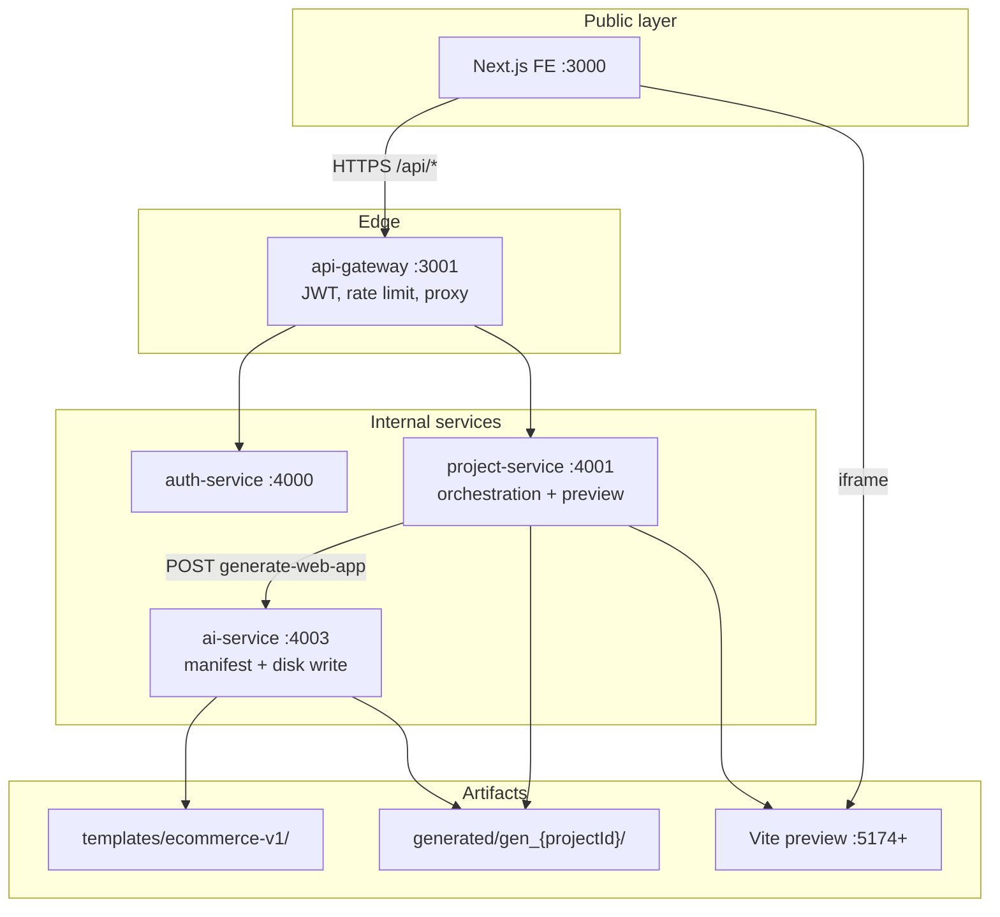

# N0 Platform — AI Project Generation Architecture (CTO Technical Brief)

**Version:** 1.0 (POC)  
**Status:** Implemented in scaffold; production hardening pending  
**Audience:** Engineering leadership  

Related docs: [demo-mental-model.md](./demo-mental-model.md) · [ai-project-response-contract-v1.md](./ai-project-response-contract-v1.md) · [generation-flow.md](./generation-flow.md) · [demo-ai-generation.md](./demo-ai-generation.md)

---

## 1. Executive summary

We are building an **AI-assisted app generator** where:

1. The user submits a natural-language prompt in the Next.js UI.
2. The **backend** (not the browser) decides whether to use a **fixed demo template** or **real AI generation**.
3. The AI returns a **versioned JSON manifest** (Contract v1): dependencies, env vars, and source files.
4. The backend **validates, materializes, installs, builds, and serves a preview** — with **no follow-up AI calls** for scaffolding.

| Layer | Responsibility |
|-------|----------------|
| **AI** | Produce structured manifest (minimal prose, file content in JSON) |
| **Backend** | Validation, dependency merge, `.env`, disk writes, build, preview |
| **Frontend** | Orchestration UI, SSE progress, iframe preview — never runs generated code |

**POC today:** Demo mode uses a static **ecommerce-v1 fixture** (`AI_PROVIDER=fixture`) — zero LLM tokens, predictable demos. Real AI path uses the same Contract v1 pipeline with Groq/OpenAI when enabled.

---

## 2. Problem we are solving

| Challenge | Our approach |
|-----------|--------------|
| High LLM cost from chatty multi-turn fixes | Single-shot **manifest**; backend normalizes output |
| Unreliable LLM package.json / Vite configs | Backend **sanitize** + merge rules |
| FE cannot safely run arbitrary generated code | **Preview runs on backend**; FE uses iframe |
| Demo reliability vs real generation | **Server-controlled generation mode** (mock vs AI) |
| Future Supabase/deploy/RLS | Contract v1 extensible without breaking FE API |

---

## 3. System architecture



**Important:** The browser never calls `ai-service` directly. Only `project-service` does (server-to-server on `:4003`).

---

## 4. End-to-end flow (prompt → preview)

### 4.1 User action (Frontend)

| Step | Component | Action |
|------|-----------|--------|
| 1 | `prompt-box.tsx` | User submits prompt |
| 2 | `logged-workspace.tsx` | `submitPrompt()` |
| 3 | `projects-store.ts` | `createProject({ prompt, ... })` |
| 4 | `projects-api.ts` | `POST /api/workspaces/{ws}/projects` |
| 5 | Router | Navigate to `/dashboard/projects/{projectId}` |
| 6 | `use-project-generation.ts` | SSE stream + poll generation status |
| 7 | `project-builder-screen.tsx` | Show activity log + iframe when `previewUrl` ready |

### 4.2 Gateway

- Routes `/api/workspaces/*` → `project-service` (`services/api-gateway/src/proxy/proxy.routes.ts`)
- Applies JWT, CORS, rate limiting (production); demo routes may use `@Public()` today

### 4.3 Project service (orchestrator)

| Function | File | Role |
|----------|------|------|
| `createProject()` | `workspaces.controller.ts` | HTTP entry |
| `createProject()` | `workspaces.service.ts` | Persist project; `setImmediate(runGeneration)` |
| `runGeneration()` | `workspaces.service.ts` | SSE, call ai-service, preview |
| `generateWebApp()` | `ai-client.service.ts` | POST + poll ai-service |
| `ensureProjectPreview()` | `preview-runtime.service.ts` | npm install → build → vite preview |

### 4.4 AI service (manifest + materialize)

| Function | File | Role |
|----------|------|------|
| `generateWebApp()` | `generation.controller.ts` | Internal API |
| `run()` | `web-app-generator.service.ts` | Provider branch + disk write |
| `buildEcommerceV1Payload()` | `fixture-loader.service.ts` | Demo template (no LLM) |
| `parseLlmWebAppPayload()` | `web-app-generation.parser.ts` | Contract v1 + sanitize |
| `writePayloadToDisk()` | `web-app-generator.service.ts` | Files + `.env` → `generated/gen_{projectId}/` |

---

## 5. AI Project Response Contract v1

Canonical schema: [ai-project-response-contract-v1.md](./ai-project-response-contract-v1.md)

```json
{
  "contractVersion": "1",
  "projectName": "ecommerce-app",
  "framework": "react-vite",
  "dependencies": ["@supabase/supabase-js", "react-router-dom"],
  "environmentVariables": [
    { "key": "VITE_SUPABASE_URL", "value": "" },
    { "key": "VITE_SUPABASE_ANON_KEY", "value": "" }
  ],
  "files": [{ "path": "src/App.tsx", "content": "..." }],
  "screens": [{ "name": "Home", "routePath": "/", "order": 1 }]
}
```

**Backend responsibilities after receiving manifest:**

1. Validate schema (required fields, unique paths, `framework === "react-vite"`)
2. Merge top-level `dependencies` into `package.json`
3. Write all files under `generated/gen_{projectId}/`
4. Write `.env` from `environmentVariables`
5. Return job status to project-service for preview pipeline

**Design intent:** AI sends **structure + code once**; backend owns everything that must be deterministic (build, deps, env, preview scripts).

---

## 6. Generation modes: mock vs AI

### 6.1 Recommended model (production)

Do **not** expose a client-only `isMockData: boolean` that the server trusts blindly. Users could spoof it to bypass billing and AI usage.

**Recommended API:**

```typescript
// POST /api/workspaces/:workspaceId/projects
{
  name: string;
  prompt?: string;
  folderId?: string | null;
  visibility: "workspace" | "personal" | "private";

  // Optional hint — server validates
  generationMode?: "auto" | "demo" | "ai";
}
```

**Server resolves effective mode:**

```typescript
type EffectiveGenerationMode = "fixture" | "ai";

function resolveGenerationMode(input: {
  dtoMode?: "auto" | "demo" | "ai";
  userPlan: "free" | "pro" | "business";  // from JWT
  envForce?: "fixture" | "ai";             // staging override
}): EffectiveGenerationMode;
```

| `generationMode` (FE) | Typical effective result |
|------------------------|---------------------------|
| `"demo"` | `fixture` — static template, **0 LLM tokens** |
| `"ai"` | `ai` if plan allows; else `fixture` or 402 |
| `"auto"` (default) | Plan-based: free → fixture, paid → ai |

**Mapping to `isMockData` concept:**

| Name | Field | Effective behavior |
|------|-------|-------------------|
| `isMockData = true` | `generationMode: "demo"` + server confirms | Fixture template, no LLM |
| `isMockData = false` | `generationMode: "ai"` + plan allows | Contract v1 via LLM |

### 6.2 Where each flag should live

| Source | Purpose | Trust level |
|--------|---------|-------------|
| **JWT / session claims** | `userId`, `plan`, `features: ["generation:ai"]` | **Authoritative** |
| **Request body `generationMode`** | User intent hint | **Validated** by server |
| **Env `FORCE_GENERATION_MODE`** | Staging/sales demo | **Authoritative** for environment |
| **Payload `isMockData: true` alone** | — | **Do not use** in production |

**Frontend example:**

```typescript
// Normal user — server decides from plan
await createProject({ prompt, generationMode: "auto" });

// Internal demo button (still server validates)
await createProject({ prompt, generationMode: "demo" });

// Paid user explicitly requesting AI
await createProject({ prompt, generationMode: "ai" });
```

**Session approach:** Store `plan` and `features` in JWT at login (auth-service). Project-service reads JWT via gateway-forwarded headers — do not store mock mode only in browser `sessionStorage`.

### 6.3 POC implementation today

| Mechanism | Current state |
|-----------|---------------|
| Demo / mock generation | `AI_PROVIDER=fixture` in `ai-service/.env` |
| Fixture template | `services/ai-service/templates/ecommerce-v1/` |
| `AI_USE_MOCK` in project-service `.env` | **Not wired in code** — env placeholder only |
| `NEXT_PUBLIC_USE_MOCK` on FE | Bypasses entire backend — separate from generation mock |

**Gap to close:** Wire `generationMode` on create + `resolveGenerationMode()` in project-service; pass `context.generationMode` to ai-service.

---

## 7. Token usage & cost model

### 7.1 Fixture / demo mode (`generationMode → fixture`)

| Metric | Value |
|--------|-------|
| LLM input tokens | **0** |
| LLM output tokens | **0** |
| LLM API calls | **0** |
| Latency | ~2–5 s (disk write + npm install + build) |
| Cost | **$0** LLM; compute only |

Template is loaded from disk (`templates/ecommerce-v1/project/`, ~15 source files).

### 7.2 Full AI mode (Contract v1, all files from LLM)

**One generation ≈ one LLM completion** (no repair loop in POC).

| Component | Estimated tokens |
|-----------|------------------|
| System prompt (Contract v1 rules) | ~350–450 |
| User prompt (e.g. “Build an ecommerce app…”) | ~20–150 |
| **Output: full manifest + file contents** | **~6,000–18,000** |
| **Total per generation (Groq 8B class)** | **~7,000–20,000 tokens** |

**Drivers of output size:** number of pages/CSS files, copy length, boilerplate in `files[]`.

**Rough cost example (Groq `llama-3.1-8b-instant`, illustrative — verify current pricing):**

- Blended rate ≈ **$0.05–0.20 / 1M tokens**
- One app generation ≈ **15k tokens** → **~$0.001–0.003 per generation**
- 10,000 generations/month → **~$10–30/month** LLM only (excluding compute)

### 7.3 Cost optimization roadmap

| Strategy | Token savings | Risk |
|----------|---------------|------|
| **Fixture for free tier** | 100% on free users | No unique apps |
| **Hybrid: fixed shell + AI pages only** | ~40–60% | Medium — template merge logic |
| **AppSpec + generator (AI writes small spec)** | ~70–90% | **High** — generator maintenance |
| **Backend sanitize (current)** | Saves *retry* tokens, not first pass | Low |

**Recommendation:** Ship **Contract v1 full manifest** for paid tier first; add **hybrid** (shell from template, AI fills `src/pages/*` only) as Phase 2. Defer pure AppSpec+generator unless domain is narrow.

### 7.4 Not charged as LLM tokens

- npm install / vite build (compute)
- Preview server (compute)
- Polling / SSE (negligible)
- Contract validation & sanitize (compute)

---

## 8. Security model

### 8.1 Current POC posture

| Area | POC today | Production requirement |
|------|-----------|------------------------|
| Gateway JWT | Partial; many workspace routes `@Public()` | All project routes JWT-protected |
| ai-service internal API | Open on `:4003`, no auth | mTLS or internal API key + network isolation |
| Client mock flag | Env-only (`AI_PROVIDER=fixture`) | Server `resolveGenerationMode()` from JWT plan |
| Generated code execution | `npm install` / `build` on host | Sandboxed containers, resource limits |
| Secrets in `.env` | Empty placeholders in demo | Secret manager; never commit real keys |
| Preview iframe | `http://localhost:{port}` | Proxied preview URL or signed tunnel |
| Rate limiting | Gateway throttler exists | Per-user generation quotas |

### 8.2 Threat model (abbreviated)

| Threat | Mitigation |
|--------|------------|
| User spoofs mock flag for free AI | Server resolves mode from **JWT plan**, not client boolean |
| Malicious npm packages in manifest | `BLOCKED_NPM_PACKAGES` + sanitize in `package-sanitize.ts` |
| Path traversal in file paths | Normalization; reject `..` |
| SSRF via ai-service | ai-service only calls configured LLM URLs |
| XSS in generated app | Preview in sandboxed iframe; separate origin in prod |
| DoS via large manifests | Body size limits (`BODY_LIMIT=2mb`); max file count |
| Untrusted code on build server | Ephemeral containers with resource limits |

### 8.3 Production security principles

1. **Never trust the browser for billing or generation mode.**
2. **ai-service is internal-only** — not exposed via api-gateway.
3. **Validate all manifests** against Contract v1 before disk write.
4. **Sandbox builds** — treat LLM output as untrusted code.
5. **Audit log** — `projectId`, `userId`, `generationModeEffective`, `templateId`, token count.
6. **Secrets** — `.env` from platform secret store, not LLM placeholders in prod.

---

## 9. Production readiness assessment

| Capability | POC | Production-ready path |
|------------|-----|------------------------|
| Contract v1 validate + materialize | ✅ | JSON Schema + file count limits |
| Demo fixture (no AI) | ✅ | Wire `generationMode: "demo"` + plan policy |
| Full AI generation | ✅ with sanitize | Queue workers + shared storage |
| Preview | ✅ localhost | Preview proxy + stable URLs |
| Publish | ❌ UI only | Build artifact upload + hosting |
| Persistence | In-memory store | Postgres |
| Multi-tenant isolation | Demo workspace | Per-workspace storage + quotas |
| Token billing | ❌ | Meter tokens in ai-service; plan limits |

**Verdict:** Architecture is **sound for production** with the guardrails above. POC trades persistence and auth strictness for demo velocity.

---

## 10. Proposed API additions

### 10.1 Create project (extended)

```http
POST /api/workspaces/{workspaceId}/projects
Authorization: Bearer {jwt}
Content-Type: application/json

{
  "name": "Untitled Project",
  "prompt": "Build an ecommerce web application for me",
  "folderId": "demo",
  "visibility": "private",
  "generationMode": "auto"
}
```

### 10.2 Create project response

```json
{
  "success": true,
  "data": {
    "id": "proj_abc123",
    "generationStatus": "pending",
    "generationModeRequested": "auto",
    "generationModeEffective": "fixture"
  }
}
```

### 10.3 Internal ai-service call

```http
POST http://ai-service:4003/api/internal/v1/generate-web-app
X-Internal-Api-Key: {secret}

{
  "jobId": "gen_proj_abc123",
  "prompt": "Build an ecommerce web application for me",
  "context": {
    "projectId": "proj_abc123",
    "workspaceId": "ws_xxx",
    "generationMode": "fixture",
    "templateId": "ecommerce-v1"
  }
}
```

### 10.4 Generation status

```json
{
  "status": "completed",
  "progress": 100,
  "previewUrl": "http://localhost:5174",
  "templateId": "fixture-ecommerce-v1",
  "generationModeEffective": "fixture",
  "filesCount": 18
}
```

---

## 11. Implementation roadmap

| Phase | Deliverable | Effort |
|-------|-------------|--------|
| **P0 (now)** | Fixture demo via `AI_PROVIDER=fixture` | Done |
| **P1** | `generationMode` on create + server policy + JWT plan | ~1 week |
| **P2** | Internal auth on ai-service; tighten project routes | ~1 week |
| **P3** | Job queue + shared artifact storage (S3/EFS) | ~2–3 weeks |
| **P4** | Sandboxed build workers | ~2 weeks |
| **P5** | Token metering + plan quotas | ~1 week |
| **P6** | Hybrid manifest (template shell + AI pages) | ~2 weeks |
| **P7** | Publish pipeline | ~3+ weeks |

---

## 12. Decision summary

1. **Achievable** — mock path (fixture) and AI path share one Contract v1 materialization pipeline.
2. **`isMockData` from FE** — use **`generationMode: "demo" | "ai" | "auto"`** as a hint; **server + JWT plan** decide effective mode.
3. **Token cost** — **zero** for demo/fixture; **~7k–20k tokens per real app** today; optimizable with hybrid templates later.
4. **Security** — main gaps: internal ai-service auth, sandboxed builds, client mock flags; fixable without redesign.
5. **AppSpec + generator** — viable for narrow domains; **risky** for open-ended prompts; prefer Contract v1 + sanitize first.

---

## 13. Code references

| Path | Content |
|------|---------|
| `services/ai-service/templates/ecommerce-v1/` | Demo fixture template |
| `services/ai-service/src/modules/generation/ai-project-manifest.v1.ts` | Contract validation |
| `services/ai-service/src/modules/generation/fixtures/fixture-loader.service.ts` | Fixture loader |
| `services/ai-service/src/modules/generation/llm/web-app-generator.service.ts` | Generation orchestration |
| `services/project-service/src/modules/workspaces/workspaces.service.ts` | `runGeneration()` |
| `services/project-service/src/modules/ai-client/ai-client.service.ts` | ai-service client |
| `services/project-service/src/modules/workspaces/preview-runtime.service.ts` | Preview pipeline |
| `N0-FE-POC/src/hooks/use-project-generation.ts` | FE SSE + poll |

---

*Token estimates are based on current Contract v1 system prompts and a ~15-file Vite React app. Measure precisely once ai-service logs `prompt_tokens` / `completion_tokens` from the LLM provider.*
