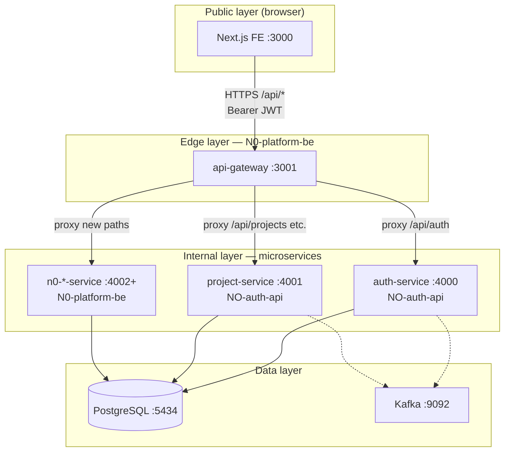
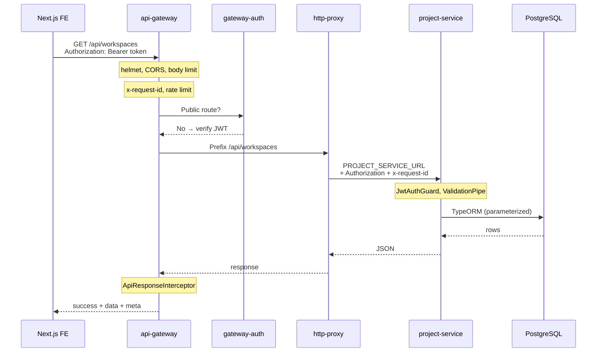

# N0 Platform Backend — Mental Model (Demo Guide)

Use this document for architecture walkthroughs, onboarding, and demos.

**One-liner:** The Next.js app calls **one API gateway** (`:3001`). The gateway applies security, then **proxies by URL path** to internal microservices. Every service returns the **same JSON envelope** to the FE.

Related docs: [architecture.md](architecture.md) · [security.md](security.md) · [fe-api-contract.md](fe-api-contract.md) · [running-services.md](running-services.md) · [port-registry.md](port-registry.md)

---

## 1. Three layers



| Layer | What lives there | Who can reach it |
|-------|------------------|------------------|
| **FE** | Next.js UI | End users |
| **Gateway** | `services/api-gateway` | FE only (production) |
| **Microservices** | auth, project, billing, … | Gateway + private network |
| **Infra** | Postgres, Kafka | Services only |

---

## 2. Repository map

```
N0-platform-be/                    ← Monorepo root (Turbo + Husky)
├── package.json                   ← npm workspaces, turbo dev/build
├── turbo.json                     ← parallel dev/build across services
├── docker-compose.yml             ← Postgres + Kafka
├── templates/
│   ├── microservice/              ← Blueprint for every new service
│   └── api-gateway/               ← Blueprint for edge gateway
├── services/
│   ├── api-gateway/               ← LIVE: public entry :3001
│   └── <slug>-service/            ← Generated internal services
├── scripts/new-service.sh         ← Scaffold new microservice
└── docs/
    ├── demo-mental-model.md       ← This file
    ├── port-registry.md           ← Port ownership
    ├── fe-api-contract.md         ← FE JSON contract
    ├── security.md
    ├── running-services.md
    └── architecture.md
```

| Location | Services |
|----------|----------|
| `NO-auth-api` (external today) | auth-service `:4000`, project-service `:4001` |
| `N0-platform-be/services` | api-gateway `:3001`, example-service `:4099`, new services `:4002+` |

---

## 3. How the frontend calls the backend

### Single base URL

```text
NEXT_PUBLIC_API_URL = http://localhost:3001/api
```

The browser **must not** call `localhost:4000` or `4001` directly in production.

### Example flows

| User action | FE request | Gateway behavior |
|-------------|------------|------------------|
| Sign up | `POST /api/auth/signup/request` | Proxy → auth (no JWT) |
| Login | `POST /api/auth/...` | Proxy → auth |
| List workspaces | `GET /api/workspaces` + Bearer | JWT check → proxy → project |
| Health | `GET /api/health` | Handled on gateway (no proxy) |

### Routing table (source of truth)

File: `services/api-gateway/src/proxy/proxy.routes.ts`

| URL prefix on gateway | Env variable | Upstream service |
|----------------------|--------------|------------------|
| `/api/auth` | `AUTH_SERVICE_URL` | auth (`:4000`) |
| `/api/workspaces` | `PROJECT_SERVICE_URL` | project (`:4001`) |
| `/api/projects` | `PROJECT_SERVICE_URL` | project (`:4001`) |
| `/api/folders` | `PROJECT_SERVICE_URL` | project (`:4001`) |

Matching uses **longest path prefix**. New domain = new row in `proxy.routes.ts` + env in gateway `.env`.

On startup, the gateway logs:

```text
[ProxyRegistry] Proxy /api/auth -> http://127.0.0.1:4000
[ProxyRegistry] Proxy /api/projects -> http://127.0.0.1:4001
```

---

## 4. Request journey (example)

**`GET /api/workspaces` with a valid JWT**



---

## 5. Security model

### A. API Gateway (edge)

| Control | Purpose |
|---------|---------|
| **helmet** | Security HTTP headers |
| **CORS** | Restrict to FE origin |
| **Body size limit** | Reject oversized payloads |
| **Throttler** | Rate limiting |
| **x-request-id** | End-to-end tracing |
| **gateway-auth** | JWT on proxied routes |
| **HTTP proxy** | Internal hosts only |

**Public at gateway (no Bearer):**

- `GET /api/health`, `GET /api/ready`
- `POST /api/auth/signup/request`, `signup/complete`, `verify-email`

All other `/api/*` proxied routes require `Authorization: Bearer <token>`.

### B. Every microservice (template)

| Control | Purpose |
|---------|---------|
| **JwtAuthGuard** (global) | Bearer JWT; `@Public()` for exceptions |
| **ValidationPipe** | DTO validation; strip unknown fields |
| **HttpExceptionFilter** | Standard error JSON for FE |
| **ApiResponseInterceptor** | Standard success JSON for FE |
| **TypeORM** | `synchronize: false`; parameterized queries |
| **Throttler** | Per-service rate limit |

Auth is **JWT only** — shared `JWT_ACCESS_SECRET` with auth-service.

### C. Production posture

```text
Internet → Load Balancer → api-gateway ONLY
                         → microservices (private network)
                         → Postgres / Kafka (not public)
```

---

## 6. FE response contract

See [fe-api-contract.md](fe-api-contract.md).

**Success:**

```json
{
  "success": true,
  "data": {},
  "meta": { "requestId": "…", "timestamp": "…" }
}
```

**Error:**

```json
{
  "success": false,
  "error": { "code": 401, "message": "…" },
  "meta": { "requestId": "…", "timestamp": "…" }
}
```

FE should branch on `error.code`, not raw HTTP text.

---

## 7. Adding a new service

```bash
cd N0-platform-be
npm run new:service -- billing 4002
```

Then:

1. Implement `src/modules/` from API contract
2. Register port in [port-registry.md](port-registry.md)
3. Add gateway route in `proxy.routes.ts`:
   ```typescript
   { path: "/api/invoices", targetEnv: "BILLING_SERVICE_URL" },
   ```
4. Set `BILLING_SERVICE_URL=http://127.0.0.1:4002` in `services/api-gateway/.env`

---

## 8. Running locally

| Goal | Command |
|------|---------|
| Infra (Postgres + Kafka) | `npm run infra:up` |
| All in-repo services | `npm run dev` |
| Gateway only | `npm run dev:gateway` |
| One service | `npm run dev:example` or `turbo dev --filter=n0-<slug>-service` |
| Build all | `npm run build` |

**Full stack** (FE + auth + projects): start auth and project from `NO-auth-api`, then `npm run dev:gateway`. Details: [running-services.md](running-services.md).

---

## 9. Demo script (5–7 min)

### Before the demo

```bash
cd N0-platform-be
npm run infra:up
npm install

# Separate terminals: auth-service (:4000), project-service (:4001) from NO-auth-api
npm run dev:gateway
```

### Talking track

| Step | Time | Show / say |
|------|------|------------|
| 1. Architecture | 30s | Three-layer diagram (§1). “FE → gateway → services → DB.” |
| 2. Routing | 1m | `proxy.routes.ts` + startup logs. “Path decides service.” |
| 3. Security | 1m | `gateway-auth.middleware.ts`, `jwt-auth.guard.ts`. “JWT at edge + service.” |
| 4. Live calls | 2m | `curl /api/health` (public), `curl /api/workspaces` (401), with Bearer (200). Show `success` + `meta.requestId`. |
| 5. Scaffold | 1m | `npm run new:service -- billing 4002` + one line in proxy routes. |
| 6. Close | 30s | Summary table (§10). |

### Live curl examples

```bash
# Public
curl http://localhost:3001/api/health

# Protected — expect 401
curl http://localhost:3001/api/workspaces

# With token
curl -H "Authorization: Bearer <token>" http://localhost:3001/api/workspaces
```

---

## 10. Summary table

| Topic | Answer |
|-------|--------|
| **What is N0-platform-be?** | Monorepo scaffold: NestJS microservices + API gateway |
| **FE entry point** | `http://localhost:3001/api` |
| **How is routing decided?** | Path prefix in `proxy.routes.ts` → env URL → service |
| **Auth** | JWT Bearer only; shared secret with auth-service |
| **Edge security** | helmet, CORS, throttling, JWT, request-id, internal proxy |
| **Service security** | JwtAuthGuard, validation, TypeORM, standard error JSON |
| **Data** | Shared Postgres `n0_platform`; optional Kafka |
| **New service** | `npm run new:service` + gateway route + port registry |
| **Tooling** | Turbo (parallel dev/build), Husky (pre-commit) |

**Executive one-liner:**  
We expose one secure API to the frontend; behind it, independently deployable services share auth, response format, and scaffolding—so new domains (e.g. billing) plug in without changing how the app calls the backend.

---

## 11. FAQ

**Why JWT at gateway and again on the service?**  
Defense in depth: services stay protected even if something reaches them without going through the gateway (misconfig, internal tools).

**How does the FE know which microservice to call?**  
It doesn’t. FE uses paths like `/api/workspaces`. The gateway maps paths to services.

**Must all services run for every demo?**  
No. Minimum for full app: infra + auth + project + gateway. Gateway-only: health + explain proxy config.

**Where are API contracts?**  
Product/API artifacts + [fe-api-contract.md](fe-api-contract.md) for JSON; [proxy.routes.ts](../services/api-gateway/src/proxy/proxy.routes.ts) for routing.
