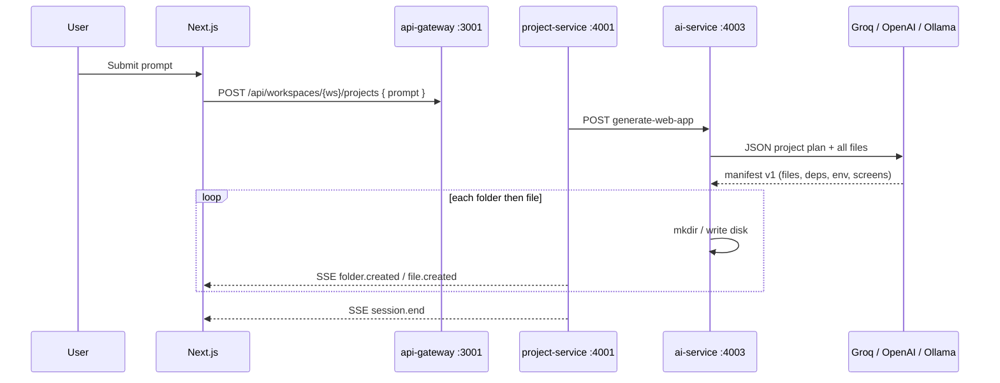

# Prompt → Generation flow (N0 Clone-style)

How the N0 platform connects **FE → project-service → ai-service (LLM)** for “describe an app, get files.”

## Sequence



Manifest schema: [ai-project-response-contract-v1.md](./ai-project-response-contract-v1.md)

CTO brief (architecture, security, tokens, mock vs AI): [cto-generation-architecture.md](./cto-generation-architecture.md)

## Stream events (FE contract)

| Event | When |
|-------|------|
| `session.start` | Job begins |
| `progress` | Status snapshot |
| `folder.created` | New directory (e.g. `src/pages/`) |
| `file.created` | New file on disk |
| `session.end` | Done or failed + screens |

The UI never imports generated code — only displays paths and content.

## Configuration (no API key required)

**ai-service** (`services/ai-service/.env`):

```env
AI_PROVIDER=local
```

| `AI_PROVIDER` | Behavior |
|---------------|----------|
| `local` | Free built-in generator (default, offline) |
| `ollama` | Free local LLM at `http://127.0.0.1:11434` |
| `openai` | Cloud API (`OPENAI_API_KEY`) |
| `auto` | openai → ollama → local |

Optional Ollama: `brew install ollama && ollama pull llama3.2`

## APIs

| Method | Path |
|--------|------|
| `POST` | `/api/workspaces/{ws}/projects` |
| `GET` | `.../projects/{id}/generation` |
| `GET` | `.../projects/{id}/generation/stream` |
| `GET` | `.../projects/{id}/files` |
| `GET` | `.../files/content?path=` |

Internal: `POST http://127.0.0.1:4003/api/internal/v1/generate-web-app`

## Run locally

```bash
cd N0-BE/services/ai-service && cp .env.example .env
# AI_PROVIDER=local is enough — no API key

cd N0-BE && npm run demo:up
cd N0-FE-POC && cp .env.demo.example .env.local && npm run dev
```

Generated sources: `N0-BE/services/ai-service/generated/gen_{projectId}/`
